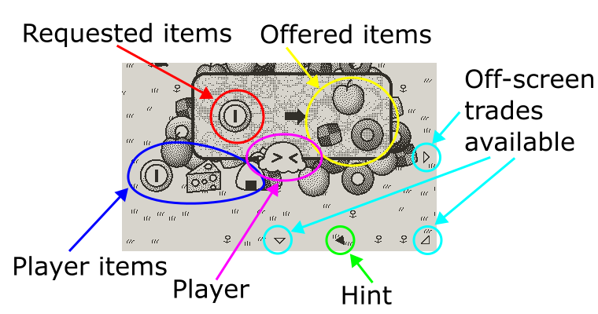

# Swap Meet

Trade items until you get your guitar back.

## Gameplay

+ **D-Pad**: move player around.
+ **A/B**: perform a trade.

+ Player: always at the center of the screen.
+ Player items: a list of items owned by the player.  Player always starts with a few coins.
+ Off-screen trades: small white triangles near edges and corners of the screen indicating the directions where more trading options are available.
+ Hint: a black triangle pointing at where player should make the next trade (hint is disabled by default, use menu option to enable it).

At each trading place, there would be a sign that lists all the items that are requested (left) and offered (right).  Player can make the trade if they are on top of the sign, and they have all the requested items.  Once a trade is made, the rules are inverted as indicated by the arrow.  Player can get back what they traded (left) if they have everything that was offered (right).

The goal is to make enough trades such that you get your guitar back.  This usually involves making several intermediate trades.  If hint display is enabled, you should be able to follow the black triangle to reach the goal, but note that multiple solutions may exist, possibly some with fewer trades.

If you wait a few seconds on the title screen, the game will run a demo mode and solve the puzzles automatically, alternating between easy and hard modes.  If hints are enabled, the demo will skip the exploration phase and go straight for the solutions, so you can get a sense of fastest possible time to each mode.

## FAQ

Q: What's the difference between "easy" and "hard"?\
A: "Hard" comes with more trade options available, so it's more difficult to plan a sequence to fulfill the goal.

Q: The hints seem fairly random.\
A: The hints are meant to show that a solution exists, and also help you find a way back to the known solution path if you got lost.  They are not always optimal.

Q: What's the background music?\
A: [Gnossienne 1](https://en.wikipedia.org/wiki/Gnossiennes) by Erik Satie.

## Source code

https://github.com/uguu-org/swap-meet
